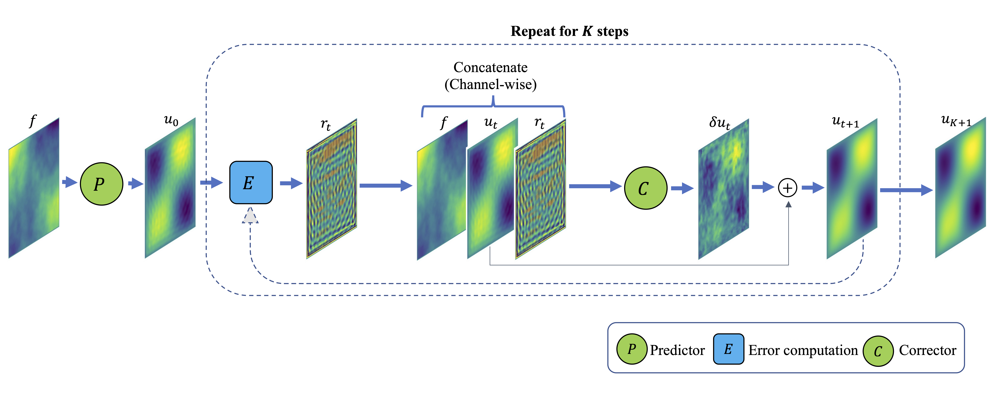
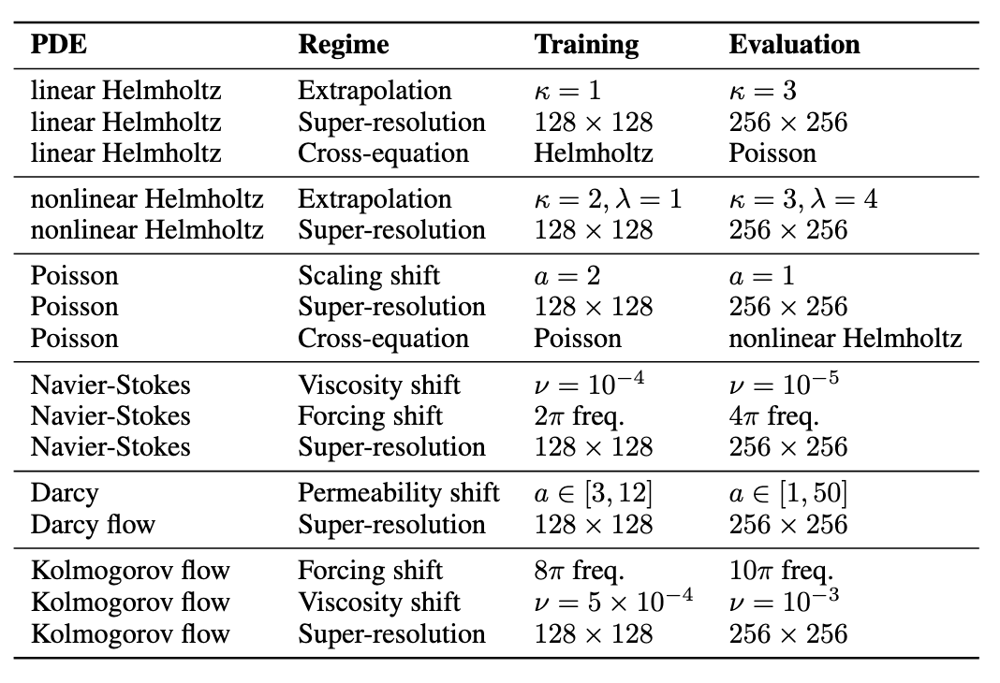

# Feed-Forward ENS

[🌐 Project Page](https://neuralsolver.github.io/) 
## Solver Structure
All PDE solvers follow the same directory structure. Below we show
`HZ_solver/` as an example.

```text
HZ_solver/
├── config/
│   └── hz.json                          # in-distribution configuration
│   └── hz_crossequation.json            # cross-equation configuration
│   └── hz_extrapolation.json            # coefficient-shift configuration
│   └── hz_superresolution.json          # resolution-shift configuration
├── data/
│   ├── training/          # place training data here
│   └── testing/           # place testing data here
├── models.py
├── train.py               # training script
├── evaluate.py            # evaluation script
├── requirements.txt
└── data_utils.py
```
## Complete Dataset

We provide a larger collection of datasets than those used in the paper. The table below summarizes the evaluation regimes reported in our experiments.
<p align="center">
  
</p>
## All Pretrained models
## Installation

```bash
conda env create -f environment.yml
conda activate Feed-Forward-ENS
```

## Helmoholtz Equation
$$\nabla^2 u + k^2 u + \lambda u^3 = f, \quad (x, y) \in [0,1]^2, \quad u = 0 \text{ on } \partial\Omega$$ 

For linear Helmholtz equation, we use $k=1$, $\lambda=0$ with $128 \times 128$ resolution for training. 

For nonlinear Helmholtz equation, we use $k=2$, $\lambda=1$ with $128 \times 128$ resoltion for training.

### Setup
```bash
pip install -r HZ_solver/requirements.txt
```

### Training
Train from scratch:

```bash
cd HZ_solver
python -u train.py --config config/hz.json
```

### Evaluation
#### Indistribution:
Use a Helmholtz test set with the same equation setting as training.

```bash
python -u evaluate.py --config config/hz.json
```
#### Extrapolation:
Use a Helmholtz test set generated with a different wave number.

Example for $k=3$:

```bash
python -u evaluate.py --config config/hz_extrapolation.json
```

#### Super-resolution:
Use a higher-resolution Helmholtz test set.

Example for $256 \times 256$:

```bash
python -u evaluate.py --config config/hz_superresolution.json
```

#### Cross-equation:
Zero-shot test on Poisson equation:

```bash
python -u evaluate.py --config config/hz_crossequation.json
```

## Poisson Equation
$$\nabla^2 u = \alpha f, \quad (x, y) \in [0,1]^2, \quad u = 0 \text{ on } \partial\Omega$$ 

We use $\alpha=2$ with $128 \times 128$ resolution for training. 

### Setup
```bash
pip install -r PS_solver/requirements.txt
```

### Training
Train from scratch:

```bash
cd PS_solver
python -u train.py --config config/ps.json
```

### Evaluation
#### Indistribution:
Use a Poisson test set with the same equation setting as training.

```bash
python -u evaluate.py --config config/ps.json
```
#### Extrapolation:
Use a Poisson test set generated with a different scaling factor.

Example for $\alpha=1$:

```bash
python -u evaluate.py --config config/ps_extrapolation.json
```

#### Super-resolution:
Use a higher-resolution Helmholtz test set.

Example for $256 \times 256$:

```bash
python -u evaluate.py --config config/ps_superresolution.json
```

#### Cross-equation:
Zero-shot test on Helmholtz equation:

```bash
python -u evaluate.py --config config/ps_crossequation.json
```

## Navier-Stokes equation
$$
\partial_\tau w + v \cdot \nabla w = \nu \Delta w + f
$$

$$
\nabla \cdot v = 0
$$

We use $\nu=1e-4$, $f= 0.1\bigl(\sin(2\pi(r_1+r_2)) + \cos(2\pi(r_1+r_2))\bigr)$ with $128 \times 128$ resolution for training. 

### Setup

```bash
pip install -r NS_solver(transformer)/requirements.txt
```
then download natten package from [here](https://drive.google.com/drive/folders/1YOgBhJIoOCietf2WkFg8sO_Zlj0K-auW?usp=sharing).

```bash
pip install wheels/natten*.whl
```
### Training
Train from scratch:

```bash
cd NS_solver(transformer)
python -u train.py --config config/ns.json
```

### Evaluation
#### Indistribution:
Use a Navier-stokes test set with the same equation setting as training.

```bash
python -u evaluate.py --config config/ns.json
```
#### Viscosity-shift:
Use a Navier-stokes test set generated with a different viscosity.

Example for $\nu = 1e-5$:

```bash
python -u evaluate.py --config config/ns_visc_shift.json
```

#### Forcing-shift:
Use a Navier-stokes test set generated with a different forcing term.

Example for $f= 0.1\bigl(\sin(4\pi(r_1+r_2)) + \cos(4\pi(r_1+r_2))\bigr)$:

```bash
python -u evaluate.py --config config/ns_f_shift.json
```

#### Super-resolution:
Use a higher-resolution Navier-stokes test set.

Example for $256 \times 256$:

```bash
python -u evaluate.py --config config/ns_superresolution.json
```
## Darcy flow:
$$\nabla \cdot (a \nabla u) = f, \quad u = 0 \text{ on } \partial\Omega$$

We use $128 \times 128$ resolution and concatenate $a$ and $f$ channel-wise for training. 
### Training
Train from scratch:

```bash
cd Darcy_solver
python -u train.py --config config/darcy.json
```
#### Evaluation
#### Indistribution:
Use a Darcy-flow test set with the same equation setting as training.

```bash
python -u evaluate.py --config config/darcy.json
```

#### Super-resolution:
Use a higher-resolution Darcy-flow test set.

```bash
python -u evaluate.py --config config/darcy_superresolution.json
```

## Test for numerical optimiztaion (Newton/Gauss-Newton/Gradient-Descent)

Example for Newton's method which initialized from noise, aiming to solve nonlinear Helmholtz equation.

```bash
cd Numerical_solver
python -u evaluate.py --config config/numerical.json
```


